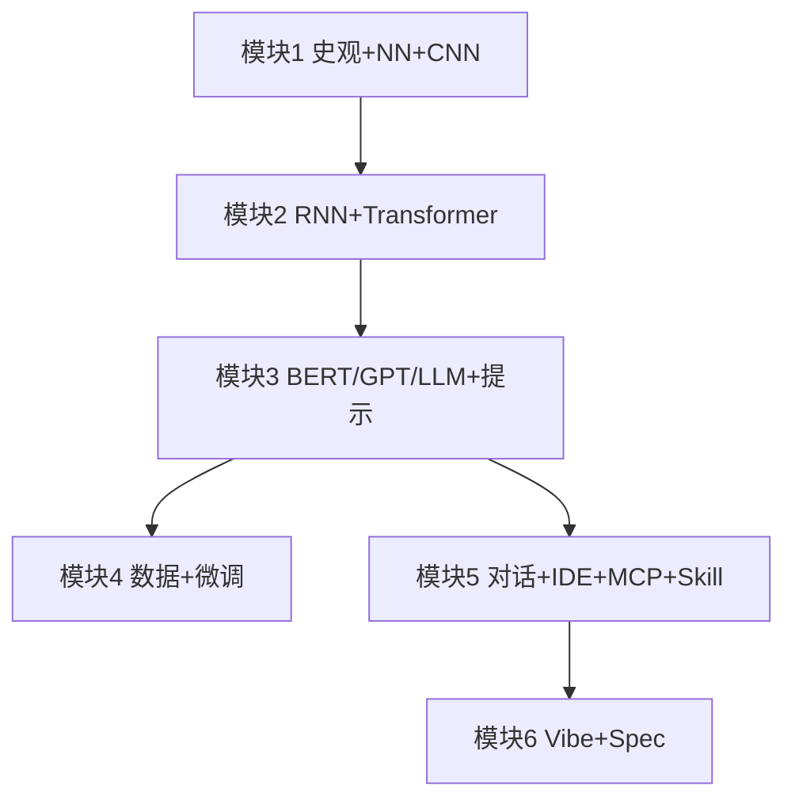
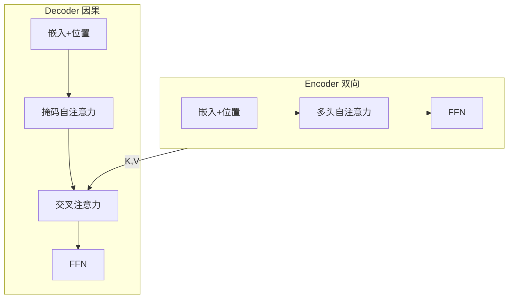
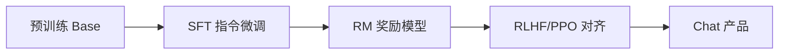

# 大模型与软件开发 · 满分期末复习

> **依据课件**：《第20次课 课程总复习.pptx》（2025 最新）  
> **考试**：**6 月 22 日 9:00–11:00 · 闭卷** · 平时 40% + 期末 60%  
> **题型**：单选 20 分 + 简答 20 分 + **案例分析 30 分** + **综合设计 30 分**  
> **原则**：**不设计算题**；重概念、对比、流程、架构选型、课件案例。  
> **配套**：细节展开见《大模型期末复习-按课件逐课详解.md》；形象图解见该文档「形象图解速查」。

---

## 目录

| 部分 | 内容 | 分值 |
|------|------|------|
| [零](#零考试信息与得分策略) | 考试信息与得分策略 | — |
| [一](#一模块1-基础神经网络--cnn) | 模块 1：AI 史观 + 神经网络 + CNN | 全覆盖 |
| [二](#二模块2-rnn--transformer) | 模块 2：RNN + Transformer | 全覆盖 |
| [三](#三模块3-bertgptllm--提示工程) | 模块 3：BERT/GPT/LLM + 提示工程 | 全覆盖 |
| [四](#四模块4-预训练数据--微调) | 模块 4：预训练数据 + 微调 | 全覆盖 |
| [五](#五模块5-对话开发--ide--mcp--上下文--skill) | 模块 5：对话开发 + IDE + MCP + 上下文 + **Skill** | 全覆盖 |
| [六](#六模块6-vibe-coding--规约驱动) | 模块 6：Vibe Coding + 规约驱动 | 全覆盖 |
| [七](#七单选题20分-考点速记) | 单选题考点速记 + 模拟题 | 20 |
| [八](#八简答题20分-标准答题模板) | 简答题标准模板 | 20 |
| [九](#九案例分析30分-题型与范例) | 案例分析题型与范例 | 30 |
| [十](#十综合设计30分-题型与范例) | 综合设计题型与范例 | 30 |
| [附](#附录必背对比表--全真模拟) | 必背对比表 + 全真模拟 | — |

---

## 零、考试信息与得分策略

### 官方题型（总复习 Slide 2）

```
┌─────────────────────────────────────────────┐
│  单选题        20 分   概念辨析、术语、选型   │
│  简答题        20 分   4–6 要点，条理清晰     │
│  案例分析      30 分   读材料 → 分析 → 改进   │  ← 占 60%
│  综合设计      30 分   给场景 → 方案 + 理由   │
└─────────────────────────────────────────────┘
```

### 满分策略

| 题型 | 时间建议 | 得分要点 |
|------|----------|----------|
| 单选 | 25 min | 抓「唯一错误项」；掩码方向、BERT/GPT、LoRA/RLHF、MCP 组件是高频 |
| 简答 | 25 min | **分点作答**（①②③）；先结论后解释；带 1 个课件案例 |
| 案例 | 35 min | **问题识别 → 原因（概念）→ 改进方案 → 预期效果** 四段式 |
| 设计 | 35 min | **架构图（文字/ASCII）+ 组件职责 + 数据流 + 风险与对策** |

### 总复习知识地图（Slide 3–8 七块）



---

## 一、模块 1：基础（神经网络 + CNN）

> **总复习考点**：AI 四次浪潮 · 感知机 · FNN · 反向传播 · CNN 动机与原理 · 经典架构 · 1D/3D 卷积

### 1.1 人工智能发展历程（第 2 讲）

**四次浪潮（必背表）**

| 浪潮 | 时期 | 范式 | 知识来源 | 代表 | 软件隐喻 |
|------|------|------|----------|------|----------|
| 第一次 | 1956–1970s | **符号主义** | 人工规则+搜索 | LT、GPS、跳棋 | 规则编程 |
| 第二次 | 1980s–1990s | **知识工程** | 专家编码 | 专家系统、XCON | 知识库+推理机 |
| 第三次 | 1990s–2010s | **统计学习** | 标注数据 | SVM、随机森林 | 特征工程 |
| 第四次 | 2012–今 | **深度学习** | 海量数据 | AlexNet、Transformer、LLM | 端到端 |

**关键概念**

- **图灵测试（1950）**：行为主义——能否在对话中被识破。≠ 图灵完备。
- **达特茅斯（1956）**：AI 学科诞生；McCarthy 提出 Artificial Intelligence。
- **弱 AI / 强 AI**：ChatGPT 仍是窄 AI（弱 AI）。
- **专家系统**：知识库 K + 推理机 I；知识获取瓶颈 → 第二次 AI 冬天。
- **M-P 神经元**：$y = f(\sum w_i x_i + b)$；**无激活则多层等价单层**。
- **连接主义复兴**：2006 Hinton DBN；2012 AlexNet；三要素：大数据、大模型、大算力。

> **🧠 口诀**：**专→知→统→深**；**图灵看演戏，弱窄不强**。

```
  专家系统 = 菜谱(知识库) + 厨师(推理机)
  四次浪潮 = 四次淘金：规则→专家→统计→深度学习
```

---

### 1.2 感知机与多层网络（第 3 章）

| 概念 | 要点 | 考试说法 |
|------|------|----------|
| **感知机** | 两层、无隐藏层、线性可分 | XOR 分不开 → Minsky 1969 |
| **MLP/FNN** | 有隐藏层 + 非线性激活 | 万能逼近 |
| **BP** | 链式法则 + 梯度下降 | 前向存 cache，反向传误差 |
| **激活函数** | ReLU 缓解消失；GELU/SwiGLU 用于 LLM | 无 f 则一层 |

**XOR 形象图**

```
  四角对角同色 → 一条直线切不开 → 需隐藏层「折空间」
```

**感知机更新**：$\Delta w = \eta(t-y)x$；线性可分则有限步收敛。

---

### 1.3 卷积神经网络 CNN（第 4 讲）

**动机**：全连接对图像参数爆炸、忽略空间局部性。

**三大核心**

| 机制 | 含义 | 比喻 |
|------|------|------|
| **局部连接** | 只看邻域 | 用放大镜扫图 |
| **权值共享** | 同一卷积核全图复用 | 同一印章盖遍全图 |
| **池化** | 降采样、平移鲁棒 | 缩略图 |

**经典演进**：LeNet → AlexNet（ReLU+Dropout+GPU）→ VGG（小卷积堆深）→ **ResNet（残差 $y=x+F(x)$）** → Inception（多尺度）。

**多维扩展（总复习点名）**

| 类型 | 场景 | 例子 |
|------|------|------|
| **1D 卷积** | 序列、文本、信号 | 文本 n-gram 特征 |
| **2D 卷积** | 图像 | 标准 CNN |
| **3D 卷积** | 视频、医学体数据 | 时空体素 |

> **🧠 口诀**：**局享移池**；ResNet **捷径保梯度**。

---

## 二、模块 2：RNN + Transformer

> **总复习考点**：全连接→循环 · BPTT · LSTM/GRU · RNN 增强 · 注意力 · 多头 · Enc-Dec · 自/交叉注意力 · 位置编码 · FFN

### 2.1 循环神经网络（第 5 章）

**RNN 核心**：隐藏状态 $h_t$ 传递历史；**参数共享**处理变长序列。

**问题**

| 问题 | 原因 | 对策 |
|------|------|------|
| 梯度消失/爆炸 | 连乘雅可比 | LSTM/GRU 门控 |
| 长程依赖弱 | 信息路径 O(n) | Attention |
| 难并行 | 时间步依赖 | Transformer |

**LSTM 三门**：遗忘门、输入门、输出门 + 细胞状态（长期记忆高速公路）。

**BPTT**：沿时间反向传播；概念题：RNN 训练通过 BPTT 回传梯度。

```
  RNN = 排队传纸条（顺序、慢）
  Attention = 会议室全员互看（并行、直链）
```

---

### 2.2 Transformer（第 6–7 讲）

**自注意力**：$\text{Attention}(Q,K,V)=\text{softmax}(\frac{QK^T}{\sqrt{d_k}})V$

| 组件 | 作用 |
|------|------|
| **Q** | 我要查什么 |
| **K** | 我是什么标签 |
| **V** | 我的内容 |
| **多头** | 多子空间并行学不同关系 |
| **位置编码** | 补顺序信息（自注意力本身无序） |
| **FFN** | 逐 token 非线性变换 |

**Encoder vs Decoder（必考）**

| | Encoder | Decoder |
|---|---------|---------|
| 自注意力 | **双向**（全可见） | **因果掩码**（只看过去） |
| 交叉注意力 | 无 | Q 来自 Dec，K/V 来自 Enc |
| 典型用途 | BERT 理解 | GPT 生成、翻译 Dec |

**推理**：自回归逐 token；**KV Cache** 缓存历史 K/V，避免重复计算。



**因果掩码矩阵（必会画）**

```
      t1 t2 t3
  t1 [ 1  0  0 ]
  t2 [ 1  1  0 ]
  t3 [ 1  1  1 ]   下三角=允许看过去
```

---

## 三、模块 3：BERT/GPT/LLM + 提示工程

> **总复习考点**：BERT 双向编码 · GPT 因果解码 · →LLM · 预训练到对齐 · 提示工程

### 3.1 BERT vs GPT（第 8–9 讲）

| 对比 | BERT | GPT |
|------|------|-----|
| 架构 | **Encoder-only** | **Decoder-only** |
| 预训练 | **MLM**（15% 掩码） | **CLM**（下一词预测） |
| 注意力 | 双向 | 因果单向 |
| 擅长 | 理解、分类、抽取 | 生成、对话、续写 |
| 特殊 token | [CLS] 整句、[SEP] 分句 | 无 [CLS] |

**MLM 为何双向**：预测被 mask 词时，左右上下文都可见；但不知道 mask 位置，不能作弊。

**GPT → LLM**：规模↑ + 数据↑ + 对齐（SFT/RLHF）→ ChatGPT 类产品。

```
  BERT = 开卷阅读理解 👀👀
  GPT  = 闭卷接龙写作   👀→
```

---

### 3.2 大语言模型 LLM（第 10 讲）

**训练三阶段**



| 阶段 | 数据 | 目标 |
|------|------|------|
| 预训练 | 万亿 token 通用语料 | 语言建模、世界知识 |
| SFT | 十万~千万指令对 | 听指令、对话格式 |
| RLHF | 人类偏好排序 | 有用、无害、诚实 |

**采样（概念）**：Temperature 控随机性；Top-p 核采样；Beam Search 多路径（翻译）。

**涌现**：规模到阈值后出现 ICL、推理、代码等能力（概念题，不手算）。

---

### 3.3 提示工程（第 11 讲）

**定义**：设计 Prompt，激发 LLM 潜在能力，从「能用」到「好用」。

**四要素**：任务指令、上下文、输入数据、输出指示。

**设计技巧**

- 具体化、分解任务、控制长度  
- 开放式 vs 封闭式  
- **差提示通病**：太宽、缺语言/代码/目标（PPT 表格必看）

**高级策略**

| 策略 | 要点 | 课件案例 |
|------|------|----------|
| **角色扮演** | 收敛领域、确立标准 | 资深算法工程师 |
| **结构化提示** | Markdown/XML 分块 | 学生成绩管理正反例 |
| **Zero/One/Few-shot** | 示例定格式 | 代码缺陷检测 |
| **CoT** | 分步思考 | 复杂推理 |
| **ReAct** | Thought→Action→Observation 循环 | 程序修复 |
| **RAG** | 检索+生成 | 开卷考试 |

**RAG 三组件**：检索器、知识库/文档、生成器（LLM）。

---

## 四、模块 4：预训练数据 + 微调

> **总复习考点**：构建流程 · 数据来源 · 处理与词元切分 · SFT · LoRA · 强化学习

### 4.1 预训练数据（第 12 讲）

**LLM 构建流程**：数据收集 → 清洗过滤 → **词元切分（BPE 等）** → 预训练 → 后训练。

**数据来源（GPT 线）**

| 类型 | 特点 |
|------|------|
| 网页 Common Crawl | 量大、噪声多，需清洗 |
| 书籍 | 质量高、长文本 |
| 百科 | 事实性 |
| 代码 GitHub | 编程能力 |
| 对话/指令 | 后训练用 |

**数据处理**：去重、质量过滤、PII 脱敏、毒性过滤、语言识别。

**词元切分**：BPE/WordPiece；子词平衡 OOV 与词表大小（概念，不手算）。

---

### 4.2 微调（第 15–16 讲）

**SFT（有监督微调）**

- 指令数据格式：`instruction` / `input` / `output`  
- Self-Instruct、Alpaca 风格；magic_conch.json + dataset_info.json 注册（实验考点）

**LoRA（Low-Rank Adaptation）**

- 冻结大权重 $W$，旁路低秩 $BA$，$W' = W + BA$  
- 参数量小、可插拔、多任务切换  
- **QLoRA**：量化 + LoRA，省显存

```
  LoRA = 大树(W)不动，绑细藤(BA)调方向
  r 越小 → 参数越少
```

**RLHF 四模型**

| 模型 | 作用 |
|------|------|
| **Policy 策略** | 生成回答（要训练的） |
| **Reward 奖励** | 给回答打分 |
| **Critic 评论家** | 估长期价值 |
| **Reference 参考** | SFT 副本，KL 约束防跑偏 |

**流程**：SFT → 收集偏好 → 训 RM → PPO 优化 Policy（概念流程题）。

**GRPO / DeepSeek-R1**：课件提及的 RL 变体，知道「用组内相对奖励简化 Critic」即可。

**SFT vs RLHF**：SFT 是 token 级交叉熵；RLHF 是整段人类偏好奖励。

---

## 五、模块 5：对话开发 + IDE + MCP + 上下文 + Skill

> **总复习考点**：对话服务 · 提示组成与技巧 · 智能 IDE · 智能体 · MCP · 上下文工程 · **Skill**

### 5.1 基于对话的软件开发（第 17–18 讲）

**特点**：自然语言、即时反馈、多轮 Session。

**能做什么**：需求、架构、编码、测试、静态分析……

**局限（案例高频）**

- 不能自动改项目文件  
- 代码分散在对话里  
- 调试需手动复制报错  
- **新 Session 失忆**

**Session 管理**

| 方式 | 优点 | 缺点 |
|------|------|------|
| 完整历史 | 信息全 | 超窗口、贵 |
| 滑动窗口 | 省 token | 忘早期 |
| 自动摘要 | 折中 | 可能丢细节 |

---

### 5.2 智能化 IDE

**vs 纯聊天**

```
  聊天：[你] ←→ [AI]
  IDE： [你] ←→ [AI] ←→ [项目/终端/Git/工具]
```

**特征**：项目级上下文、文件索引、补全、Agent 执行任务、规则文件。

**Function Calling 六步**：工具定义 → LLM 决策 → JSON 调用 → 执行 → Observation → 继续推理。

---

### 5.3 MCP（Model Context Protocol）

**三方架构**

```
  Host（Cursor/IDE）
    └── Client（发现&调用）
          │ MCP 协议
    ┌─────┴─────┐
  Server A    Server B
  (GitHub)    (数据库)
```

| 组件 | 职责 |
|------|------|
| **Host** | 承载应用（IDE） |
| **Client** | 连接、发现、调用 Server |
| **Server** | 暴露工具/资源/提示模板 |

---

### 5.4 上下文工程

**vs 提示工程**

- 提示：管**这一句**怎么问  
- 上下文：管**整场对话/整个项目**喂什么

**上下文腐蚀**：token 增多 → 早期规则失效、质量下降。

**典型技术**

| 技术 | 作用 |
|------|------|
| 压缩/摘要 | 省 token |
| 结构化笔记 | 外置记忆写文件 |
| 子 Agent | 专任务探索，只回摘要 |
| 工作区限定 | 缩小文件范围 |
| Git 上下文 | diff、历史 |
| 规则文件 | 项目规范 .md |
| # 手动引用 | 精准投喂文件/函数 |

---

### 5.5 Skill（技能）——总复习新增重点

**定义**：为特定任务封装可复用 **SOP（标准处理流程）** 的能力模块；智能体的「专业能力说明书」。

**与其他概念区别**

| 概念 | 类比 |
|------|------|
| 普通 Prompt | 一次性任务沟通 |
| **Tool** | 软件/API（能执行） |
| **Rule** | 项目准则（必须遵守） |
| **Skill** | 资深同事的工作流经验（可复用 SOP） |

**适用场景**：领域专家经验、可复用工作流、一致输出、步骤可追踪。

**目录结构**

```
  my-skill/
  ├── Skill.md      ← 核心：名称、Description、触发场景、知识正文
  ├── Scripts/      ← 可执行脚本
  ├── References/   ← 参考文档
  └── Assets/       ← 模板、图片
```

**渐进式披露**：启动只加载名称+描述 → 任务匹配才读完整 Skill.md → 按需加载脚本/资源。

**内置例子**：IDE 自动检索相关代码 ≈ 一种内置 Skill。

---

## 六、模块 6：Vibe Coding + 规约驱动

> **总复习考点**：Vibe 流程/技巧/场景/风险 · Spec-Driven

### 6.1 Vibe Coding（Karpathy 2025）

**定义**：开发者用自然语言描述意图，AI 负责实现；人从「写代码」变为「定目标+验收」。

**核心流程（闭环）**

```
  定义意图 → AI 生成 → 运行观察 → 反馈调整 → 重复直到满意
```

**特点**

- 从「怎么做」到「做什么」  
- 从线性流程到**迭代闭环**  
- 能力重心：需求拆解、边界定义、风险预判、结果校验  

**适用**：快速原型、MVP、探索性开发。

**风险与局限（案例/设计必写）**

- 架构债务、安全漏洞  
- 可维护性下降  
- 开发者底层能力退化  
- 代码质量不可控  

> **🧠 口诀**：**Vibe 漂，Spec 牢**。

---

### 6.2 规约驱动开发（Spec-Driven）

**核心**：**先写规格/契约**（需求、接口、验收标准），再让 AI 按规约生成。

| 对比 | Vibe Coding | Spec-Driven |
|------|-------------|-------------|
| 起点 | 模糊意图 | 明确规约 |
| 流程 | 边做边改 | 先定后做 |
| 验收 | 感觉对了 | 对照契约 |
| 比喻 | 即兴爵士 | 按谱演奏 |

---

### 6.3 部署实践（实验流程考点）

**Ollama**：本地 `ollama run`；`ollama.chat()`。

**LLaMA-Factory 九步**

1. 租 GPU / SSH  
2. clone + conda **Python 3.10**  
3. `pip install -e ".[torch,metrics]"`  
4. `webui` → 端口 **7860**  
5. HF 下载基座（镜像 `HF_ENDPOINT`）  
6. 上传 magic_conch.json，注册 dataset_info.json  
7. LoRA 微调  
8. **Export** 合并权重  
9. FastAPI **8000** 部署  

> **🧠 7860 练，8000 服，Export 合并**

---

## 七、单选题（20 分）考点速记

### 7.1 50 个高频考点

1. 图灵测试 = 行为主义，非图灵完备  
2. 四次浪潮顺序：符号→知识→统计→深度  
3. 专家系统 = 知识库 + 推理机  
4. XOR → 单层感知机不行 → 需隐藏层  
5. 无激活函数 → 多层 = 单层  
6. BP = 链式法则 + 梯度下降  
7. CNN：局部连接、权值共享、池化  
8. ResNet 残差解决梯度消失  
9. 1D 卷积用于序列/文本  
10. RNN 难并行；BPTT 训练  
11. LSTM 门控缓解长程依赖  
12. Attention：$Q,K,V$，除以 $\sqrt{d_k}$  
13. Encoder 双向；Decoder 因果掩码  
14. 位置编码补顺序  
15. KV Cache 加速推理  
16. BERT = MLM + Encoder-only  
17. GPT = CLM + Decoder-only  
18. [CLS] 用于分类  
19. 预训练 vs 后训练：数据量/目标不同  
20. Temperature ↑ → 更随机  
21. RAG = 检索 + 生成  
22. ReAct = Thought-Action-Observation  
23. LoRA 低秩旁路，冻结 W  
24. RLHF 四模型：Policy/Reward/Critic/Reference  
25. RM 不能聊天，只打分  
26. SFT 是 token CE；RLHF 是偏好奖励  
27. 对话开发不能自动改文件  
28. Session 三种管理方式  
29. MCP：Host-Client-Server  
30. 上下文腐蚀 = 长对话质量降  
31. Skill = SOP 封装，渐进式披露  
32. Skill.md 是核心  
33. Vibe = 意图驱动迭代  
34. Spec = 先规约后生成  
35. 7860 webui / 8000 API  
36. magic_conch 三字段：instruction/input/output  
37. ICL 不需要梯度更新（推理时）  
38. 弱 AI ≠ 强 AI/AGI  
39. AlexNet 2012 深度学习复兴标志  
40. Transformer 2017  
41. WordPiece/BPE 子词切分  
42. Top-p 核采样  
43. 交叉注意力：Dec Q，Enc K/V  
44. 第二次 AI 冬天：知识获取瓶颈  
45. 软件 3.0：提示词是新程序  
46. 结构化提示减少幻觉  
47. CoT 提升复杂推理  
48. QLoRA = 量化 + LoRA  
49. Reference 模型 KL 约束  
50. 自动上下文检索 ≈ 内置 Skill  

### 7.2 模拟单选题（20 题）

1. 图灵测试的核心判定依据是（B）  
   A. 机器能否通过所有数学测试 B. 人类能否从对话中区分机器与人  
   C. 机器是否图灵完备 D. 机器是否有自我意识  

2. 单层感知机无法解决 XOR 的根本原因是（C）  
   A. 学习率太小 B. 缺少池化 C. 线性不可分 D. 缺少 BP  

3. CNN 权值共享的主要作用是（A）  
   A. 减少参数、平移等变 B. 增加模型深度 C. 替代激活函数 D. 实现双向注意力  

4. ResNet 的核心创新是（D）  
   A. 1D 卷积 B. 因果掩码 C. MLM D. 残差捷径连接  

5. RNN 相比 Transformer 的主要劣势是（B）  
   A. 不能处理序列 B. 顺序计算难并行、长程依赖弱  
   C. 参数更少 D. 不需要训练  

6. Decoder 自注意力使用因果掩码是为了（A）  
   A. 生成时不能看未来 token B. 实现双向理解  
   C. 减少参数量 D. 替代位置编码  

7. BERT 预训练使用的任务是（C）  
   A. 下一词预测 B. 翻译 C. 掩码语言模型 MLM D. 强化学习  

8. GPT 系列属于哪种架构（B）  
   A. Encoder-only B. Decoder-only C. Encoder-Decoder D. CNN  

9. LLM 对齐阶段 RLHF 中 Reference 模型的主要作用是（D）  
   A. 生成最终回答 B. 检索文档 C. 分词 D. KL 约束防偏离 SFT 太远  

10. LoRA 微调的特点是（A）  
    A. 冻结原权重，训练低秩旁路 B. 全参数更新 C. 只改词表 D. 不需要数据  

11. RAG 架构中不包含以下哪一项（D）  
    A. 检索器 B. 知识库 C. LLM D. 反向传播训练检索器（非必需组件描述）  

12. 对话式大模型开发的主要局限不包括（C）  
    A. 不能自动改项目文件 B. 跨 Session 失忆  
    C. 完全不能写代码 D. 调试需手动复制上下文  

13. MCP 中负责连接外部工具服务的是（B）  
    A. Host B. Server C. User D. Tokenizer  

14. Skill 的「渐进式披露」是指（A）  
    A. 先加载名称描述，匹配后再读完整 Skill.md  
    B. 一次性加载所有 Skill 全部内容  
    C. 只加载 Scripts 不加载文档 D. 禁止动态加载  

15. 上下文腐蚀是指（C）  
    A. GPU 过热 B. 模型参数损坏  
    C. 对话过长导致早期指令失效 D. 词表过大  

16. Vibe Coding 相比 Spec-Driven 更强调（B）  
    A. 先写详细接口契约 B. 意图驱动的快速迭代  
    C. 形式化验证 D. 禁止 AI 生成代码  

17. LLaMA-Factory 训练 Web UI 默认端口是（A）  
    A. 7860 B. 8000 C. 3306 D. 6379  

18. 以下属于高级提示策略的是（D）  
    A. 只写「帮我写程序」 B. 不提供任何上下文  
    C. 拒绝结构化 D. ReAct  

19. Self-attention 中除以 $\sqrt{d_k}$ 是为了（B）  
    A. 增加随机性 B. 稳定 softmax 梯度尺度  
    C. 实现因果性 D. 减少层数  

20. 预训练与后训练的主要区别是（C）  
    A. 后训练用万亿 token B. 预训练只做 RLHF  
    C. 预训练学通用能力，后训练做指令对齐 D. 没有区别  

<details><summary>答案</summary>1B 2C 3A 4D 5B 6A 7C 8B 9D 10A 11D 12C 13B 14A 15C 16B 17A 18D 19B 20C</details>

---

## 八、简答题（20 分）标准答题模板

> 每题约 **4–5 分**，写 **4–6 个要点**；建议「总括句 + 分点 + 课件例子」。

### 模板 1：简述 AI 四次浪潮（5 分）

① **第一次符号主义**（1956–70s）：规则+搜索，LT/GPS；遇组合爆炸→AI 冬天。  
② **第二次知识工程**（80–90s）：专家系统 K+I，XCON 商业成功；知识获取瓶颈→第二次冬天。  
③ **第三次统计学习**（90s–2010s）：SVM 等，特征工程，数据驱动。  
④ **第四次深度学习**（2012–今）：AlexNet、Transformer、LLM，端到端表示学习。  
⑤ **规律**：承诺—失望—新范式；工程选型需技术史观。

---

### 模板 2：BERT 如何实现双向理解？（4 分）

① 架构：**Encoder-only**，自注意力无因果掩码，token 可互看。  
② 预训练：**MLM**，随机 mask 约 15% token，预测被遮词。  
③ 预测时左、右上下文均参与，故为**双向**。  
④ 不知道 mask 位置，避免标签泄漏。  
⑤ 应用：[CLS] 句级分类、问答、抽取。

---

### 模板 3：Encoder 与 Decoder 掩码有何不同？（4 分）

① **Encoder**：自注意力**全连接**，所有位置互可见 → 适合理解。  
② **Decoder**：**因果下三角掩码**，位置 $i$ 只能看 $\le i$ → 适合生成。  
③ Decoder 另有**交叉注意力**，Q 来自目标侧，K/V 来自 Encoder 输出。  
④ 翻译：Enc 编码源句，Dec 自回归生成目标句。

---

### 模板 4：简述 RLHF 流程与四模型（5 分）

① **SFT** 得基础对话模型。  
② 收集人类对多个回答的**偏好排序**。  
③ 训练 **Reward Model** 拟合人类偏好。  
④ **PPO** 优化 **Policy**，**Critic** 估价值，**Reference** 提供 KL 锚点。  
⑤ 目标：有用、无害、符合人类价值观。

---

### 模板 5：RAG 架构及三组件（4 分）

① **检索器**：将问题编码，从知识库找 Top-K 相关片段。  
② **知识库/文档**：外部可信知识（向量库或关键词索引）。  
③ **生成器（LLM）**：将检索结果拼入 Prompt，**有据生成**。  
④ 解决 LLM 幻觉、知识过时、领域私有数据问题。

---

### 模板 6：LoRA 原理与优势（4 分）

① 冻结预训练权重 $W$，旁路低秩矩阵 $A,B$。  
② 更新 $\Delta W = BA$，$r \ll$ 原维度。  
③ **优势**：参数少、显存省、可插拔、多任务切换。  
④ **QLoRA**：量化基座 + LoRA，进一步省显存。

---

### 模板 7：MCP 三组件及职责（4 分）

① **Host**：IDE 等宿主应用。  
② **Client**：在 Host 内，发现、连接、调用 Server。  
③ **Server**：对接 GitHub、数据库等外部系统，暴露工具/资源。  
④ 标准化 LLM 与外部世界的连接，类似「USB 协议」。

---

### 模板 8：Skill 是什么？与 Tool、Rule 区别（5 分）

① **Skill**：封装领域 **SOP** 的可复用能力模块，含 Skill.md 等。  
② **Tool**：可执行 API/软件；Skill 是「怎么做」的知识流程。  
③ **Rule**：强制约束；Skill 是经验指南，按需加载。  
④ **渐进式披露**：先名称描述，匹配后读全文，省 token。  
⑤ 例：代码评审流程、Web 测试 SOP。

---

## 九、案例分析（30 分）题型与范例

> **答题框架**：① 问题是什么 → ② 根因（用课程概念）→ ③ 改进方案 → ④ 预期效果

### 案例类型 A：差提示词改进（高频）

**材料**：用户提示「帮我写个登录功能」，模型输出 Flask 片段，但与项目 Django+JWT 栈不符，且无安全说明。

**参考答案要点**

| 步骤 | 内容 |
|------|------|
| 问题 | 提示过宽：缺语言、框架、认证方式、安全要求 |
| 根因 | 未用提示四要素；未结构化；未角色/约束 |
| 改进 | 结构化 Markdown：#角色 #技术栈 #安全要求 #输出格式；Few-shot 给接口示例 |
| 效果 | 输出可集成、含 CSRF/哈希/过期策略，减少幻觉 |

---

### 案例类型 B：对话开发 vs 智能 IDE

**材料**：团队用 ChatGPT 多轮改 5 个文件的 API，每次新开会话要重讲架构，且代码需手动粘贴。

**参考答案要点**

| 步骤 | 内容 |
|------|------|
| 问题 | 无项目感知、无文件系统、Session 失忆、效率低 |
| 根因 | 对话服务无工作区、无工具执行 |
| 改进 | 迁移智能 IDE：工作区索引、#引用文件、Agent 批量编辑、规则文件统一规范 |
| 效果 | 多文件联动、上下文可持续、可运行终端验证 |

---

### 案例类型 C：长对话质量下降

**材料**：20 轮后 AI 忘记「必须用 TypeScript」规则，开始输出 JavaScript。

**参考答案要点**

| 步骤 | 内容 |
|------|------|
| 问题 | **上下文腐蚀**，早期系统指令被挤出窗口 |
| 根因 | 完整历史堆叠超 token；无压缩/规则外置 |
| 改进 | 规则写入 `.cursorrules`；滑动窗口+摘要；关键约束每轮重申；子 Agent 分任务 |
| 效果 | 长会话仍遵守技术栈约束 |

---

### 案例类型 D：Vibe 项目失控

**材料**：用 Vibe Coding 三天做出电商 Demo，上线后发现 SQL 拼接注入、无测试、模块耦合。

**参考答案要点**

| 步骤 | 内容 |
|------|------|
| 问题 | 重速度轻规约与安全；缺验收标准 |
| 根因 | Vibe 适合原型，未做 Spec/Review/测试 |
| 改进 | 转 Spec-Driven：先写安全规约+API 契约；引入 SAST 提示；人工 Code Review |
| 效果 | 可控质量，降低架构债务 |

---

### 案例类型 E：微调选型

**材料**：7B 模型需在 24G 显卡上做领域客服微调，数据 5000 条指令。

**参考答案要点**

| 步骤 | 内容 |
|------|------|
| 问题 | 全量微调 OOM；数据量中等 |
| 方案 | **LoRA/QLoRA** + SFT；instruction/input/output 格式；LLaMA-Factory |
| 理由 | 参数高效、可 Export 合并、7860 可视化训练 |
| 备选 | 若仅改行为不重训：先提示工程 + RAG 知识库 |

---

### 自练案例题（3 道）

1. 用户用「这个报错怎么解决」提问，未贴代码和报错，分析原因并改写提示。  
2. 比较 BERT 与 GPT 在「情感分类」和「故事续写」任务上的选型。  
3. 某 IDE 需接入 GitHub Issue，说明 MCP 方案各组件分工。

<details><summary>参考答案提纲</summary>
1. 缺输入数据/上下文；改写：贴 traceback+相关代码+环境+已尝试步骤+期望输出格式。  
2. 情感分类→BERT+微调/few-shot；续写→GPT 因果生成。  
3. Host=IDE；Client 发现 Server；GitHub MCP Server 暴露 list/create issue 工具；LLM Function Calling 调用。
</details>

---

## 十、综合设计（30 分）题型与范例

> **答题框架**：场景分析 → 总体架构（ASCII/Mermaid）→ 模块职责 → 关键流程 → 风险对策

### 设计题类型 A：多文件重构的上下文方案（课件经典）

**题目**：智能化 IDE 中，用户要求「将项目中所有 REST API 改为 GraphQL」，涉及 10+ 文件。设计上下文工程方案。

**参考答案结构**

**1. 场景分析**

- 跨文件依赖、需统一规范、长任务易腐蚀。

**2. 架构**

```
  用户指令
     ↓
  规则文件（GraphQL 命名/错误处理规范）
     ↓
  工作区索引 → 检索相关 route/model 文件
     ↓
  子 Agent：逐模块分析 → 摘要回传
     ↓
  主 Agent：按 Spec 批量 Edit + 终端跑测试
     ↓
  Git diff 供人 Review
```

**3. 组件**

| 组件 | 作用 |
|------|------|
| 规则 .md | 持久约束，防腐蚀 |
| # 引用 | 精准指定入口路由文件 |
| 子 Agent | 大项目分治，控 token |
| MCP Git | 读 Issue/PR 上下文 |
| Skill | 封装「REST→GraphQL 迁移 SOP」 |

**4. 风险**：漏改接口 → 用搜索工具全库扫描；幻觉 → 每步跑测试 Observation。

---

### 设计题类型 B：企业代码审查助手

**题目**：设计基于 LLM 的代码审查系统，要求可解释、可接入 GitLab、审查规则可配置。

**参考要点**

- **RAG**：检索公司编码规范文档  
- **Prompt**：结构化输出（缺陷类型/位置/原因/修复/严重级）  
- **MCP Server**：连 GitLab API 拉 MR diff  
- **Skill**：`code-review/SKILL.md` 定义审查步骤 SOP  
- **Rule**：禁止审查通过含硬编码密钥  
- **人机协同**：AI 建议 + 人工最终 Approve  

---

### 设计题类型 C：领域客服模型落地

**题目**：为校内教务系统设计问答助手，知识更新频繁，预算有限。

**参考要点**

- **Base**：开源 Instruct 模型（Ollama 本地或云端）  
- **RAG** > 全量微调（知识常变）  
- 若固定话术多：少量 **SFT** + **LoRA**  
- 数据：instruction/input/output；dataset_info 注册  
- 部署：7860 训练 → Export → 8000 API  
- 评测：人工抽检 + 拒答策略（不知道时说不知道）

---

### 自练设计题（2 道）

1. 设计「SQL 注入检测」自动化流程（结合课件 Prompt 示例 + CI 集成）。  
2. 比较 Vibe 与 Spec 完成同一需求分析文档项目的流程设计。

<details><summary>参考答案提纲</summary>
1. CI 触发→拉 diff→结构化 Prompt（角色安全工程师+输出六要素）→SAST 工具 MCP→结果写回 MR 评论。  
2. Vibe：意图迭代快速出稿；Spec：先模板/验收标准/接口清单→AI 填充→评审_gate。
</details>

---

## 附录：必背对比表 + 全真模拟

### 一、30 组必背对比

| 对比 | A | B |
|------|---|---|
| 弱/强 AI | 窄任务 | 通用+意识 |
| 专家系统 | 知识库 | 推理机 |
| 感知机/MLP | 无隐藏层 | 有隐藏层 |
| CNN/全连接 | 局部共享 | 全局密集 |
| 1D/2D/3D 卷积 | 序列/图/视频 | — |
| RNN/Transformer | 顺序 O(n) | 并行+Attention |
| LSTM/普通RNN | 门控长记忆 | 易消失 |
| Encoder/Decoder | 双向 | 因果 |
| 自注意力/交叉注意力 | 同序列 | Dec Q + Enc KV |
| BERT/GPT | MLM 双向 | CLM 单向 |
| Base/Instruct | 预训练 | SFT+对齐 |
| 预训练/后训练 | 万亿语料 | 指令级 |
| 提示/微调 | 改上下文 | 改参数 |
| 提示/上下文工程 | 单轮设计 | 全程管理 |
| SFT/RLHF | token CE | 整段奖励 |
| LoRA/全量微调 | 低秩旁路 | 更新全部 |
| RAG/纯 LLM | 检索+生成 | 闭卷 |
| ReAct/CoT | 调工具循环 | 只推理 |
| 对话/IDE | 无文件系统 | 项目+工具 |
| MCP Host/Server | 应用 | 外部能力 |
| Skill/Tool | SOP 知识 | 可执行 API |
| Skill/Rule | 经验流程 | 强制约束 |
| Vibe/Spec | 意图迭代 | 先规约后做 |
| Session 全历史/滑窗 | 全/贵 | 省/忘 |
| 上下文腐蚀/压缩 | 问题 | 对策 |
| ICL/微调 | 推理时示例 | 改权重 |
| RM/Policy | 打分 | 生成 |
| Reference/Policy | KL 锚 | 被优化 |
| 7860/8000 | 训练 UI | 推理 API |
| BPE/词 | 子词 | 整词 |

### 二、全真模拟卷（100 分）

**一、单选 20 题** → 见 [§7.2](#72-模拟单选题20-题)

**二、简答 4 题 × 5 分 = 20 分**（任选 4 题作答）

1. 四次 AI 浪潮及范式特征。  
2. BERT MLM 如何实现双向理解。  
3. RLHF 流程与四模型职责。  
4. MCP 与 Function Calling 的关系与区别。  
5. Skill 的定义、结构、工作机制。

**三、案例分析 1 题 × 30 分**

> 某团队仅用网页版 ChatGPT 维护 Java 微服务项目。项目经理抱怨：（1）每次都要重新解释包结构；（2）AI 给的代码无法直接跑通；（3）五人协作时规范不统一。  
> **请**：识别问题 → 分析原因 → 提出基于智能化 IDE 的改进方案（含上下文工程、规则、Skill、MCP 至少各一点）。

<details><summary>评分要点（30 分）</summary>
- 问题识别 8 分：失忆、无工具、无项目上下文、无规范  
- 原因分析 8 分：对话局限、无 Session 工程、无工作区  
- 方案 10 分：IDE 工作区+#引用+规则文件+Skill(SOP)+MCP(Git/CI)  
- 条理与术语 4 分
</details>

**四、综合设计 1 题 × 30 分**

> 为课程「大模型与软件开发」设计一个 **实验辅导智能体**：能回答 LoRA 微调步骤、检查 magic_conch.json 格式、提示常见端口与 Export 流程。  
> **请**：画出架构、说明 Prompt/RAG/Skill/规则如何分工，并给出 2 条风险对策。

<details><summary>评分要点（30 分）</summary>
- 架构清晰 10 分：用户→IDE/Agent→RAG(课件/文档)→Skill(实验SOP)  
- 组件分工 10 分：规则约束 JSON 三字段；RAG 检索 LLaMA-Factory 文档  
- 风险 6 分：幻觉→引用来源；误导操作→步骤校验清单  
- 表达 4 分
</details>

---

### 三、考前 24 小时 checklist

- [ ] 默画：因果掩码下三角、RLHF 四模型、RAG 流程、MCP 三方  
- [ ] 默讲：四次浪潮、BERT vs GPT、LoRA、Skill 渐进式披露  
- [ ] 过一遍：差提示词表、Vibe vs Spec 对比表、7860/8000 流程  
- [ ] 练写：1 道案例分析 + 1 道综合设计（限时 70 分钟）  

---

**文档关系**

| 文档 | 用途 |
|------|------|
| **本文** | 按总复习提纲 + **题型突破**（冲满分） |
| 《按课件逐课详解》 | PPT 逐讲深度 + 形象图解 |
| 《90分标准》 | 更多练习题（计算可忽略） |

祝 6 月 22 日考试顺利。
